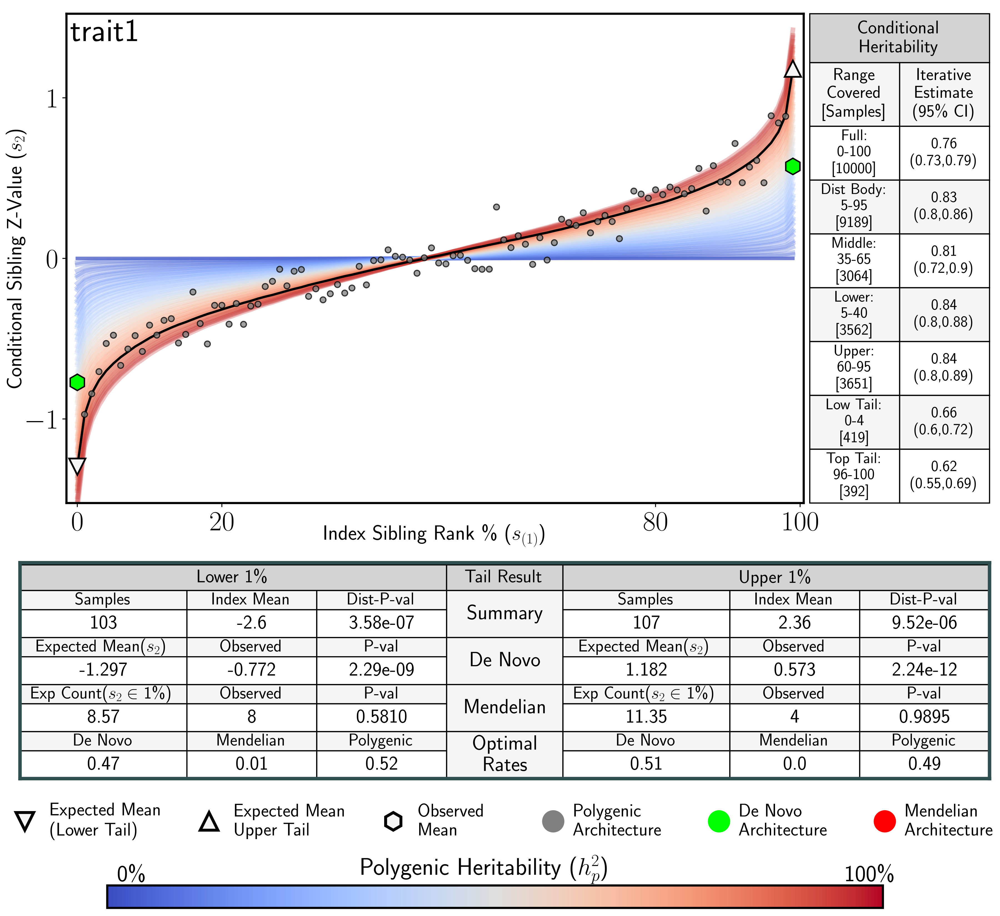

[//]:                                                                                                                                                                                                  
# Interpreting SibArc Results 

                                                                                                                                                                                                                            
                                                                                                                                                                                                                            
!!! tips "A trait with denovo tail architecture in both tails (denovoExample.fig.png)"                                                                                                                                                  
    
    
    
    Notice:  
    1. Evidence of De Novo architecture in both trait tails.                                                                                                                                                                             
    2. Lower heritability in both trait tails.                                                                                                                                                                                                                  

!!! tips "A trait with Mendelian tail architecture in both tails (mendelianExample.fig.png)"                                                                                                                                                  
    
    
    
    Notice:  
    1. Polygenic architecture in the lower tail, Mendelian heritability in the upper tail.                                                                                                                                                                             
    2. Increased heritability in the upper tail.                                                                                                                                                                        
    
                                                                                                                                                                                                                            
                                                                                                                                                                                                                            
                                                                                                                                                                                                                            

